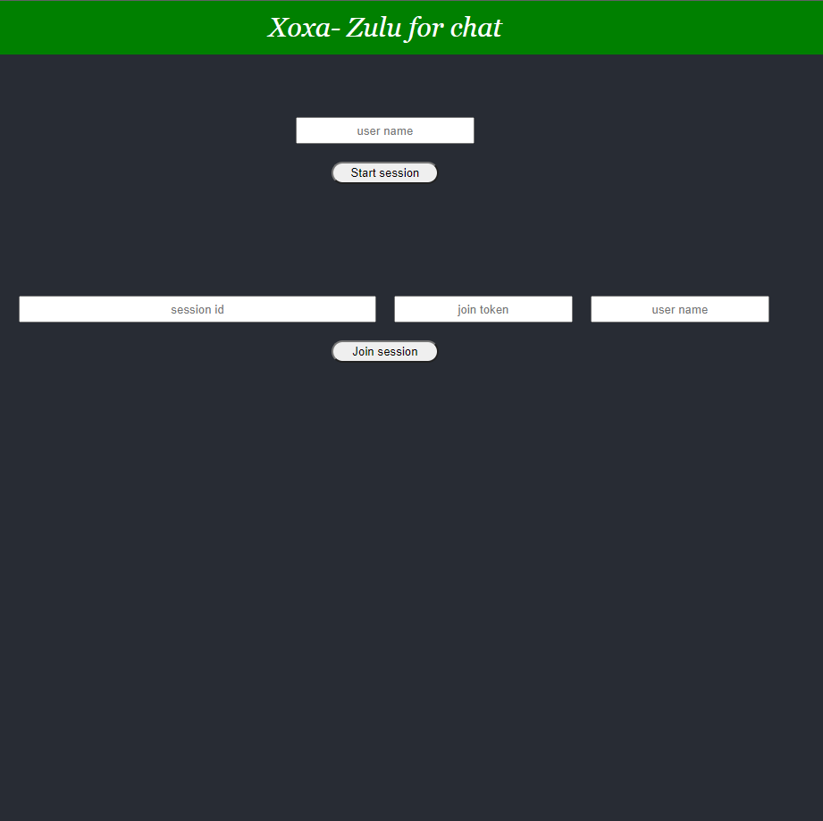
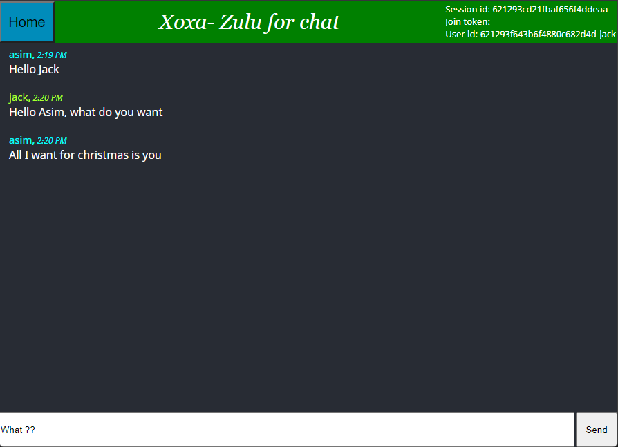
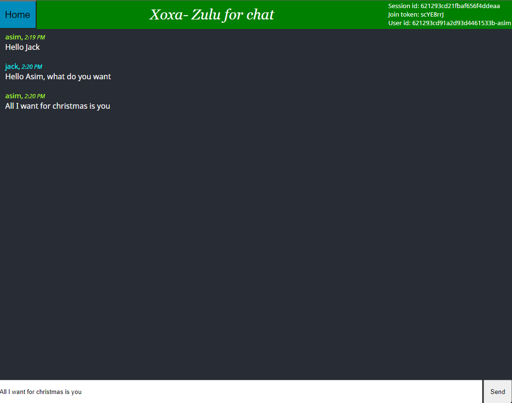

# Xoxa - Zulu for chat

This is a simple websocket based chat app. The goal was to build a simple chat app and learn about websocket along the way.

# Screenshots
### Home page

### Chat page 1

### Chat page 2

# Tech Used
- Spring boot
- MongoDB
- React JS
- WebSocket
- STOMP messaging protocol
- Memory based message broker

# Steps to run the app

### Run `npm install`
Installs the dependencies

### Run `npm start`
Runs the app in the development mode.\
Open [http://localhost:3000](http://localhost:3000) to view it in your browser.

### Run `./mvnw spring-boot:run` in xoxa-backend
Runs the backend application

# ISSUES 

- Messages are not being saved to database when being sent from the React UI. But if the messages are sent from src/main/resources/static/app.js (in the backend), the messages are saved.

- Some components reload with every state change. Can be fixed by making seperate components and keeping states and components that states influence closer and enclosed.
